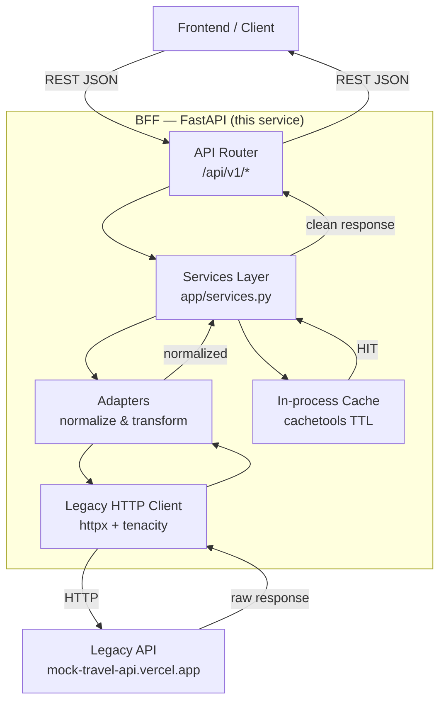
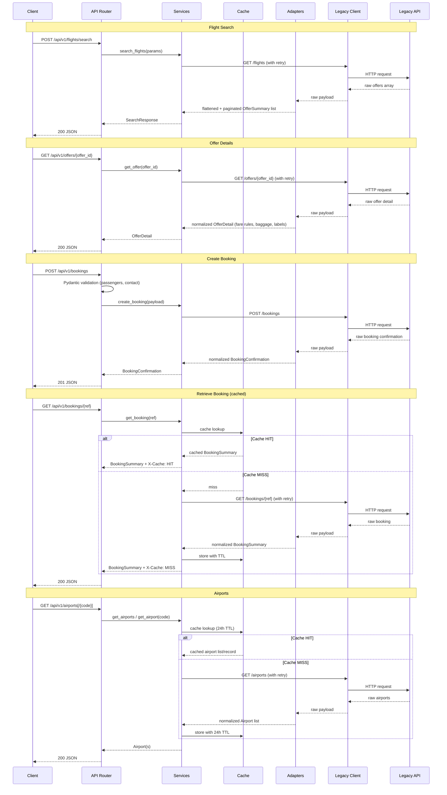

# System Design & Data Flow

## System Architecture

```mermaid
graph TD
    Client["Frontend / Client"]

    subgraph BFF["BFF — FastAPI (this service)"]
        Router["API Router\n/api/v1/*"]
        Services["Services Layer\napp/services.py"]
        Adapters["Adapters\nnormalize & transform"]
        Cache["In-process Cache\ncachetools TTL"]
        LegacyClient["Legacy HTTP Client\nhttpx + tenacity"]
    end

    Legacy["Legacy API\nmock-travel-api.vercel.app"]

    Client -->|"REST JSON"| Router
    Router --> Services
    Services --> Cache
    Services --> Adapters
    Adapters --> LegacyClient
    LegacyClient -->|"HTTP"| Legacy
    Legacy -->|"raw response"| LegacyClient
    LegacyClient --> Adapters
    Adapters -->|"normalized"| Services
    Cache -->|"HIT"| Services
    Services -->|"clean response"| Router
    Router -->|"REST JSON"| Client
```

## Data Flow

```mermaid
sequenceDiagram
    participant C as Client
    participant R as API Router
    participant S as Services
    participant CA as Cache
    participant A as Adapters
    participant LC as Legacy Client
    participant L as Legacy API

    Note over C,L: Flight Search
    C->>R: POST /api/v1/flights/search
    R->>S: search_flights(params)
    S->>LC: GET /flights (with retry)
    LC->>L: HTTP request
    L-->>LC: raw offers array
    LC-->>A: raw payload
    A-->>S: flattened + paginated OfferSummary list
    S-->>R: SearchResponse
    R-->>C: 200 JSON

    Note over C,L: Offer Details
    C->>R: GET /api/v1/offers/{offer_id}
    R->>S: get_offer(offer_id)
    S->>LC: GET /offers/{offer_id} (with retry)
    LC->>L: HTTP request
    L-->>LC: raw offer detail
    LC-->>A: raw payload
    A-->>S: normalized OfferDetail (fare rules, baggage, labels)
    S-->>R: OfferDetail
    R-->>C: 200 JSON

    Note over C,L: Create Booking
    C->>R: POST /api/v1/bookings
    R->>R: Pydantic validation (passengers, contact)
    R->>S: create_booking(payload)
    S->>LC: POST /bookings
    LC->>L: HTTP request
    L-->>LC: raw booking confirmation
    LC-->>A: raw payload
    A-->>S: normalized BookingConfirmation
    S-->>R: BookingConfirmation
    R-->>C: 201 JSON

    Note over C,L: Retrieve Booking (cached)
    C->>R: GET /api/v1/bookings/{ref}
    R->>S: get_booking(ref)
    S->>CA: cache lookup
    alt Cache HIT
        CA-->>S: cached BookingSummary
        S-->>R: BookingSummary + X-Cache: HIT
    else Cache MISS
        CA-->>S: miss
        S->>LC: GET /bookings/{ref} (with retry)
        LC->>L: HTTP request
        L-->>LC: raw booking
        LC-->>A: raw payload
        A-->>S: normalized BookingSummary
        S->>CA: store with TTL
        S-->>R: BookingSummary + X-Cache: MISS
    end
    R-->>C: 200 JSON

    Note over C,L: Airports
    C->>R: GET /api/v1/airports[/{code}]
    R->>S: get_airports / get_airport(code)
    S->>CA: cache lookup (24h TTL)
    alt Cache HIT
        CA-->>S: cached airport list/record
    else Cache MISS
        S->>LC: GET /airports (with retry)
        LC->>L: HTTP request
        L-->>LC: raw airports
        LC-->>A: raw payload
        A-->>S: normalized Airport list
        S->>CA: store with 24h TTL
    end
    S-->>R: Airport(s)
    R-->>C: 200 JSON
```
