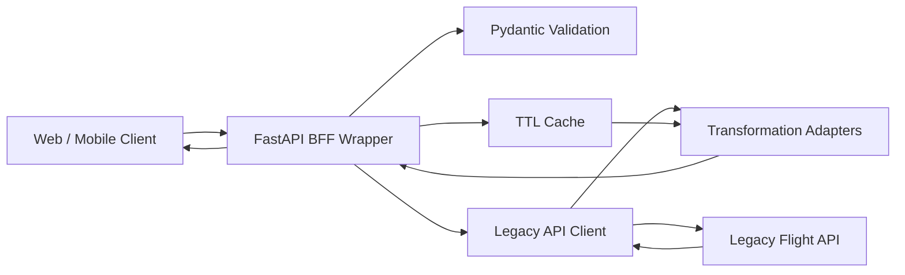
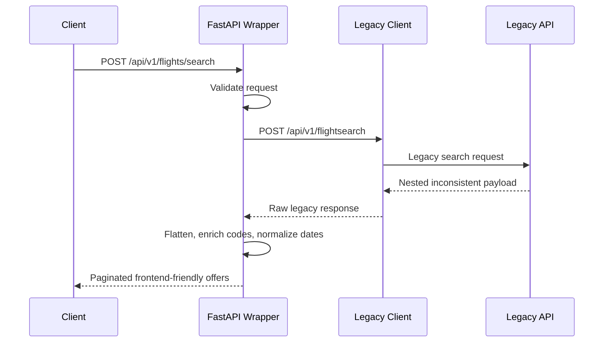
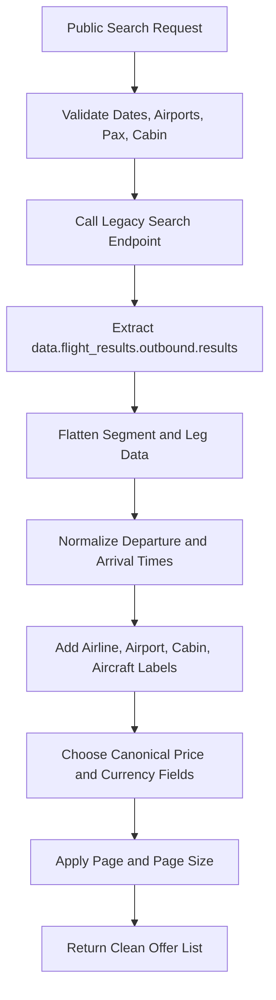
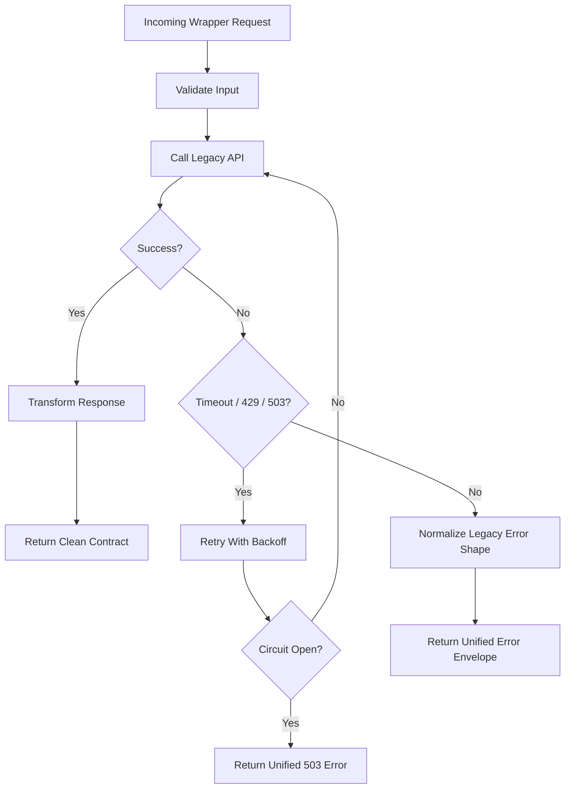

# Flight Booking API Wrapper - Implementation Plan

## 1. Assignment Goals and Success Criteria

Build a Backend-for-Frontend API wrapper that hides the legacy flight API's inconsistent URLs, nested payloads, duplicate fields, mixed date formats, cryptic codes, and inconsistent error shapes.

Success means a frontend developer can use one predictable API for the full booking flow:

- Search flights with a simple request and receive paginated, UI-ready offers.
- Fetch offer details with fare rules, baggage, refund/change policies, and readable labels.
- Create bookings with strong wrapper-side validation before calling the legacy API.
- Retrieve bookings through a clean summary endpoint that demonstrates caching.
- Understand the design through generated API docs, repository documentation, tests, and AI workflow notes.

Because the assignment guideline is 6-8 hours, the implementation should optimize for a complete, demoable vertical slice over exhaustive production hardening. The best outcome is a clean end-to-end wrapper with obvious extension points, focused tests, and honest documentation about what would be improved with more time.

## 2. Chosen Stack

- **FastAPI REST** for fast delivery, type-driven request/response contracts, and built-in OpenAPI documentation.
- **Pydantic v2** for validation, schema generation, and normalized public models.
- **httpx** for async upstream HTTP calls to the legacy API.
- **cachetools** for lightweight in-process TTL caching.
- **tenacity** for retries with bounded exponential backoff.
- **pytest + respx** for API tests and mocked upstream HTTP behavior.
- **Docker Compose** as a stretch polish item after the local run path works.

REST is the best fit for this assignment because the required flow maps naturally to resources and commands, while FastAPI gives the interviewers an immediate Swagger UI to inspect.

## 3. Public API Contract Summary

All wrapper endpoints use consistent versioning, naming, validation, and error responses.

| Method | Endpoint | Purpose |
| --- | --- | --- |
| `POST` | `/api/v1/flights/search` | Search flights and return paginated, flat offers. |
| `GET` | `/api/v1/offers/{offer_id}` | Return enriched offer details. |
| `POST` | `/api/v1/bookings` | Validate passenger details and create a booking. |
| `GET` | `/api/v1/bookings/{booking_reference}` | Retrieve a clean booking summary with caching. |
| `GET` | `/api/v1/airports` | Return normalized airport metadata. |
| `GET` | `/api/v1/airports/{code}` | Return one normalized airport record. |
| `GET` | `/health` | Service health check. |

Public response fields use camelCase and avoid leaking legacy aliases such as `offer_id`, `offerId`, `StatusCode`, `CurrencyCode`, `totalAmountDecimal`, or mixed date fields.

Unified error shape:

```json
{
  "error": {
    "code": "UPSTREAM_TIMEOUT",
    "message": "The flight provider did not respond in time.",
    "status": 503,
    "requestId": "req_123",
    "details": {}
  }
}
```

## 4. System Architecture



Layer responsibilities:

- **Routes** accept public API requests, apply response models, and expose Swagger examples.
- **Schemas** define clean downstream contracts with validation rules and documented examples.
- **Services** coordinate validation, caching, legacy calls, transformation, and error handling.
- **Legacy client** contains the inconsistent upstream URLs and HTTP behavior in one place.
- **Adapters** translate legacy payloads into stable frontend-friendly models.
- **Reference data** maps airline, cabin, aircraft, passenger, payment, tax, and booking status codes to labels.

## 5. End-to-End Booking Flow



Full flow:

1. Client searches flights through `/api/v1/flights/search`.
2. Wrapper validates airport codes, cabin, passenger count, and dates.
3. Wrapper calls the legacy `/api/v1/flightsearch` endpoint.
4. Search adapter flattens nested segment data, normalizes prices, labels codes, and paginates results.
5. Client selects an `offerId` and calls `/api/v1/offers/{offer_id}`.
6. Wrapper calls legacy `/api/v2/offer/{offer_id}` and returns fare rules, baggage, payment rules, and policy labels.
7. Client submits passenger/contact details to `/api/v1/bookings`.
8. Wrapper validates names, passenger count, email, phone, date of birth, nationality, and passport fields before forwarding to `/booking/create`.
9. Client retrieves the booking through `/api/v1/bookings/{booking_reference}`; the wrapper returns cached summaries for repeated reads.

## 6. Search Transformation Flow



Transformation rules:

- Prefer canonical legacy fields when duplicates disagree, then document the precedence in adapter tests.
- Convert all dates and times to RFC 3339 strings.
- Use airport timezone metadata when legacy date values omit timezone information.
- Expose both `durationMinutes` and a readable `duration`.
- Include stop count, segment summaries, baggage summary, seats remaining, and refundability.
- Keep raw upstream payloads out of public responses.

## 7. Error and Resilience Flow



Resilience behavior:

- Use short connection and read timeouts so frontend clients are not left waiting indefinitely.
- Retry only safe transient failures: timeout, `429`, and `503`.
- Do not retry booking creation automatically unless the request is explicitly idempotent.
- Open a circuit after repeated upstream failures and return a clear `503` wrapper error until the cooldown passes.
- Normalize all known legacy error formats:
  - `{"error": {"message": "...", "code": 400}}`
  - `{"errors": [{"code": "...", "detail": "..."}]}`
  - `{"fault": {"faultstring": "...", "faultcode": "..."}}`
  - `{"status": "error", "msg": "..."}`
- Include request IDs in logs and error responses for easier debugging.

## 8. Caching Strategy

```mermaid
flowchart TD
  BookingRequest[GET /api/v1/bookings/{ref}] --> CacheCheck{Booking Cache Hit?}
  CacheCheck -->|Yes| Cached[Return Cached Summary + X-Cache HIT]
  CacheCheck -->|No| Fetch[Fetch Legacy Reservation]
  Fetch --> Transform[Normalize Booking Summary]
  Transform --> Store[Store Short TTL Cache]
  Store --> Fresh[Return Summary + X-Cache MISS]

  AirportRequest[Airport Metadata Needed] --> AirportCache{Airport Cache Hit?}
  AirportCache -->|Yes| UseAirport[Use Cached City/Timezone]
  AirportCache -->|No| FetchAirport[Fetch Legacy Airport Detail]
  FetchAirport --> StoreAirport[Store 24h TTL]
  StoreAirport --> UseAirport
```

Cache decisions:

- Airport metadata is stable, so cache airport list and single-airport lookups for 24 hours.
- Booking retrieval is read-heavy but can change, so cache booking summaries for a short TTL such as 2 minutes.
- Search results are not cached by default because price and seat availability are time-sensitive.
- Booking creation is never cached.
- Responses that use booking cache include `X-Cache: HIT` or `X-Cache: MISS`.
- The first implementation uses in-process TTL cache; the design can be upgraded to Redis without changing public API contracts.

## 9. Testing Plan

- Unit test date parsing for ISO 8601, Unix epoch, `DD/MM/YYYY`, `YYYYMMDDHHMMSS`, and `DD-Mon-YYYY` formats.
- Unit test search transformation using captured legacy fixtures with direct and connecting flights.
- Unit test offer transformation for fare rules, baggage conflicts, payment methods, and expiration dates.
- Unit test booking transformation and validation failures.
- Unit test code-label enrichment and unknown-code fallbacks.
- API test all public endpoints with FastAPI test client.
- Mock upstream failures with `respx`: `400`, `404`, `429`, `503`, timeout, malformed JSON, and unexpected response shape.
- Test retry behavior for safe calls and no automatic retry for non-idempotent booking creation.
- Test cache behavior with `MISS` followed by `HIT`.
- Run a live smoke script against the stable legacy API and a separate simulated-instability check using `simulate_issues=true`.

## 10. AI-Assisted Development Workflow

AI use should be documented as part of the submission because the role explicitly evaluates AI prompting and validation habits.

Planned workflow:

- Use AI to summarize the assignment, identify high-value rubric items, and draft the API contract.
- Use AI to inspect legacy OpenAPI docs and generate candidate fixture-based transformer tests.
- Use AI to draft Pydantic schemas, adapter outlines, and edge-case lists.
- Manually verify AI output against live API responses, tests, and Swagger docs.
- Keep prompts and corrections in `docs/ai-workflow.md` or a dedicated section of the main documentation.

The documentation should include:

- Tools used.
- Prompts that worked well.
- One area where AI accelerated implementation.
- One area where AI was wrong, incomplete, or overcomplicated the design.
- How outputs were validated through tests, manual API calls, and code review.

## 11. Eight-Hour Execution Plan

### Hour 0-1 - Foundation

- Initialize project structure, dependencies, settings, and `.env.example`.
- Add FastAPI app, health endpoint, route grouping, and OpenAPI metadata.
- Build the legacy API client with settings-driven base URL, timeout, and request logging.
- Add shared error envelope and basic exception handler.
- First commit: runnable app with `/health` and `/docs`.

### Hour 1-3 - Flight Search Vertical Slice

- Implement `POST /api/v1/flights/search`.
- Flatten the legacy search response into UI-ready offers.
- Normalize prices, airline/cabin labels, airport labels, segment summaries, stops, duration, and dates.
- Add pagination with `page`, `pageSize`, `total`, and `items`.
- Add 2-3 transformer tests from captured legacy fixtures.
- Second commit: working search endpoint.

### Hour 3-4.5 - Offer and Booking Flow

- Implement `GET /api/v1/offers/{offer_id}` with fare rules, baggage, payment rules, and policy labels.
- Implement `POST /api/v1/bookings` with strict passenger/contact validation.
- Implement `GET /api/v1/bookings/{booking_reference}` with normalized booking summary.
- Keep route code thin by putting transformation logic in adapters.
- Third commit: complete search-to-booking flow.

### Hour 4.5-5.5 - Caching and Resilience

- Add airport metadata cache with 24h TTL.
- Add booking retrieval cache with short TTL and `X-Cache` response header.
- Add timeouts and retry behavior for safe legacy reads.
- Normalize the four known legacy error formats into the public error envelope.
- Add simple circuit-breaker behavior only if time remains after retries and error normalization.
- Fourth commit: cache and resilience behavior.

### Hour 5.5-6.5 - Focused Tests

- Add API tests for happy-path search, offer detail, booking create validation, and booking retrieval.
- Add mocked upstream tests for one timeout or `503`, one `404`, and one malformed or unexpected payload.
- Add cache test showing `MISS` followed by `HIT`.
- Keep coverage focused on the behavior interviewers will inspect.
- Fifth commit: test coverage for core risks.

### Hour 6.5-8 - Documentation and Final Polish

- Update `README.md` with setup, run, test, and sample curl commands.
- Add or finish AI workflow notes: tools used, prompts, acceleration, correction, validation.
- Keep this implementation plan and Mermaid diagrams in the repo.
- Verify `/docs` renders, run the test suite, and run one live smoke search.
- Add Docker Compose only if the local workflow, tests, and docs are already complete.
- Final commit: documentation and interview-ready polish.

### 8-Hour Cut Line

Must finish:

- Search, offer details, create booking, retrieve booking.
- Clean public schemas and unified errors.
- One real cache demonstration.
- Focused tests for transformations, errors, and cache.
- README plus AI workflow documentation.

Defer if time is tight:

- Full circuit breaker sophistication.
- Redis or external cache.
- Broad aircraft/tax/payment code catalogs.
- Deployment.
- High test coverage across every edge case.

## 12. What Interviewers Should Notice

- The wrapper fully hides legacy complexity instead of forwarding awkward upstream payloads.
- Public contracts are typed, documented, consistent, and designed around frontend needs.
- Transformation code is separated from routing and tested with realistic ugly fixtures.
- Error handling is deliberate, not incidental.
- Caching choices are explained by data volatility.
- The project shows practical AI fluency: faster exploration and scaffolding, but with human verification and course correction.
